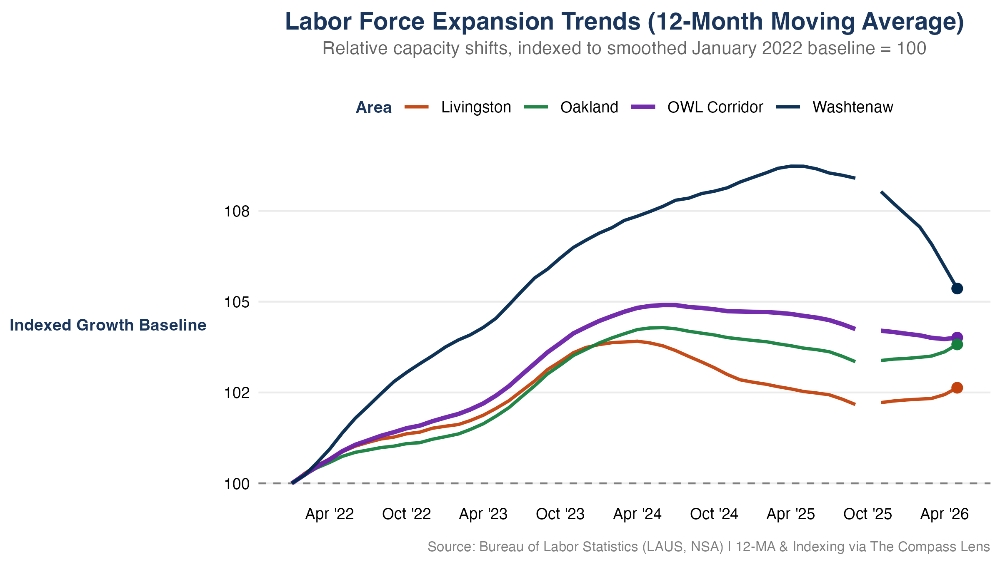

```{r}
#| label: setup
#| include: false

library(tidyverse)
library(readr)
library(scales)
library(here) # Now safely anchored by the .here file

# 'here' builds clean paths from the root down
PROCESSED_DIR <- here("data", "processed")
PLOT_DIR      <- here("plots")

master_data <- read_rds(file.path(PROCESSED_DIR, "master_county_pulse.rds"))

# Process the date tracking variables
latest_date     <- max(master_data$date, na.rm = TRUE)
latest_date_str <- format(latest_date, "%B %Y")

# Isolate snapshot to the absolute latest month
latest_snapshot <- master_data %>% 
  filter(date == latest_date)

# Extract scalar rates for the latest month using latest_snapshot
owl_rate   <- latest_snapshot %>% filter(county_name == "OWL Corridor") %>% pull(unemployment_rate)
state_rate <- latest_snapshot %>% filter(county_name == "Michigan (Statewide)") %>% pull(unemployment_rate)
rate_gap   <- state_rate - owl_rate
``` 

## Executive Summary

This regional brief highlights the post-pandemic structural labor market dynamics across the **OWL Corridor** (Oakland, Washtenaw, and Livingston counties). Utilizing data integrated dynamically via the Local Area Unemployment Statistics (LAUS) program, these metrics reflect localized labor force shifts and regional stability.

The latest updated metrics in this report reflect data through **`r latest_date_str`**.

---

## Unemployment Rate Trajectories

The chart below outlines the regional unemployment rate for each of the member counties. The **purple line** establishes the aggregate baseline for the **OWL Corridor**, while **green** indicates Oakland County, **navy** represents Washtenaw County, and **orange** represents Livingston County. The statewide Michigan average is shown in **light gray** for comparison. While individual county trends appear muted relative to the primary corridor baseline, their alignment underscores how tightly integrated these local economies are.

::: {.panel-tabset}

### Unemployment Visualization

{#fig-unemployment width=100%}

### Core Unemployment Takeaways

* **Structural Stabilization:** Typically, Livingston County exhibits the lowest unemployment rate, followed by Oakland and Washtenaw counties. The post-pandemic normalization of unemployment rates across the corridor is evident, with all three counties converging toward historical baselines. Recently the rates have increased slightly across the corridor, while remaining in line with the historical range since mid 2024. 
* **Corridor Alignment:** The unemployment rate for the counties of the OWL Corridor moves in unison with the regional rate, suggesting that the corridor is a cohesive labor market unit. The corridor's unemployment rate is currently at **`r round(owl_rate, 1)`%**, which is **`r round(rate_gap, 1)`%** below the state average of **`r round(state_rate, 1)`%**. The statewide unemployment rate generally trends above the OWL Corridor and its member counties, suggesting that the corridor has a more robust labor market than the state average.

:::

---

## Labor Force Capacity & Growth Scales

To observe true relative resource scaling, local labor supply capacities are indexed to a baseline of **January 2022 = 100**. This removes pure absolute scale differences (such as Oakland's larger raw population) to trace true expansion velocities.

::: {.panel-tabset}

### Labor Force Visualization

{#fig-laborforce width=100%}

### Core Labor Force Takeaways
* **Indexed Growth:** The labor force for all three counties in the OWL Corridor has expanded since January 2022. Washtenaw County has experienced more pronounced swings in its labor force compared to the other counties of the corridor. Oakland and Livingston counties appear to have lagged behind Washtenaw and the statewide trends through early 2025. Current analysis suggests these counties are returning to parity with Washtenaw and the state by maintaining their momentum as the labor forces of Washtenaw and the state have cooled.  
* **Relative Velocity:** A monthly analysis of the labor force would suggest that Washtenaw County has moved in tandem with the statewide trend but is diverging from the rest of the corridor. The 12-month moving average index shows that Washtenaw is instead returning to parity with the corridor trend, suggesting that the county is returning to a more normalized labor market after a period of increased labor market involvement. This could also be a reflection of the county's larger demographic makeup which may be entering a period of structural change. 

:::

> **Methodological Note:** An indexed baseline of 100 means a metric value of 104 represents a clean 4% expansion in the total available labor supply pool since January 2022, regardless of raw population counts.

***

> **Data Note:** *Metrics reflect official LAUS/BLS benchmarks as of `r format(Sys.Date(), "%B %d, %Y")`. Historical series incorporate all revised estimates released through `r latest_date_str`. In October 2025, a lapse in federal funding prohibited the collection of LAUS data. There is no LAUS data for October 2025.*

---

## Data Provenance & Reliability

Data streams are ingested directly from primary federal and state reporting nodes, including the U.S. Bureau of Labor Statistics (BLS). Technical calculations, data processing, and visualization builds are automated programmatically by The Compass Lens core data architecture to eliminate transcription vulnerabilities; however, downstream metrics remain reliant on the underlying accuracy and fidelity of official source releases.

All data, analysis, and views presented herein are independent work products of Great Lakes Center for Economics and are subject to standard historical revisions by official reporting agencies.

| Metric Component | Primary Source Agency | Spatial Resolution | Update Cadence | Adjustments |
| :--- | :--- | :--- | :--- | :--- |
| **Local Area Unemployment** | Bureau of Labor Statistics (LAUS) | County Level | Monthly | Not Seasonally Adjusted (NSA) |
| **Consumer Sentiment** | University of Michigan | National Baseline | Monthly | Not Seasonally Adjusted (NSA) |
