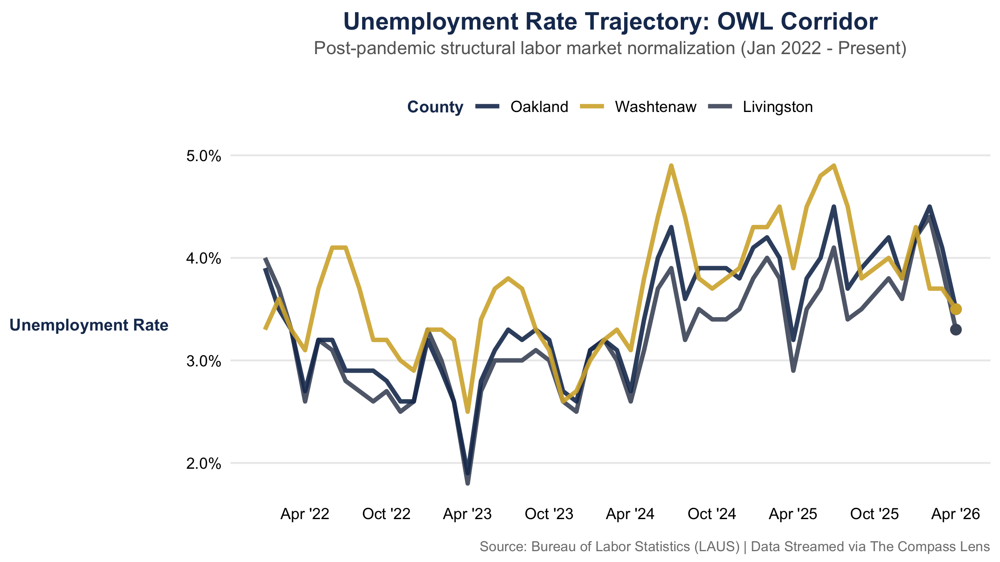
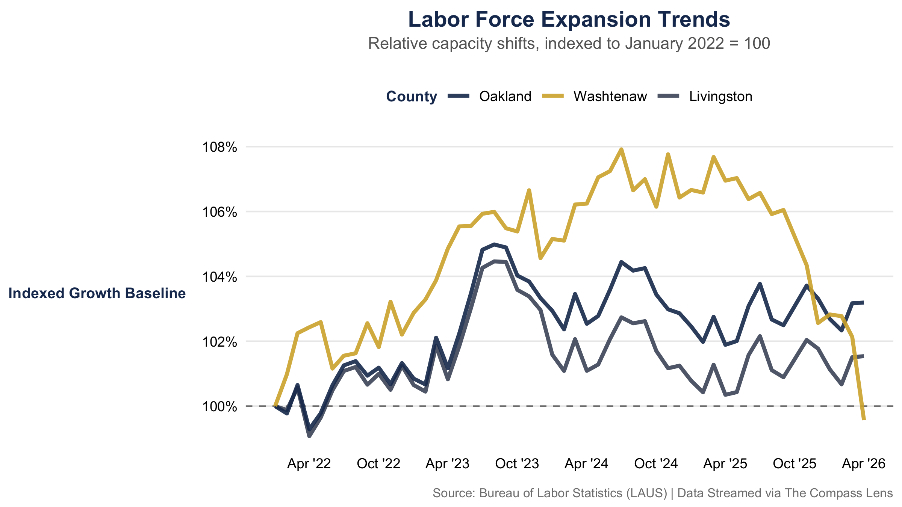

```{r}
#| label: setup
#| include: false

library(tidyverse)
library(readr)
library(scales)
library(here) # Now safely anchored by the .here file

# 'here' builds clean paths from the root down
PROCESSED_DIR <- here("data", "processed")
PLOT_DIR      <- here("plots")

master_data <- read_rds(file.path(PROCESSED_DIR, "master_county_pulse.rds"))

# 4. Process the remaining pipeline variables
latest_date     <- max(master_data$date)
latest_date_str <- format(latest_date, "%B %Y")

latest_snapshot <- master_data %>% 
  filter(date == latest_date)
``` 

## Executive Summary

This regional brief highlights the post-pandemic structural labor market normalization across the **OWL Corridor** (Oakland, Washtenaw, and Livingston counties). Utilizing data integrated dynamically via the Local Area Unemployment Statistics (LAUS) program, these metrics reflect localized labor force shifts and regional stability.

The latest updated metrics in this report reflect data through the active reporting period.

---

## Unemployment Rate Trajectories

The chart below outlines the structural normalization of the regional unemployment rate. The deep navy line establishes the baseline for institutional scale, while gold spotlights key localized divergence.

::: {.panel-tabset}

### Chart Visualization

{#fig-unemployment width=100%}

### Core Takeaways

* **Structural Stabilization:** Regional unemployment rates continue to trend near historical baselines, moving out of post-pandemic fluctuations into long-term equilibrium.
* **Corridor Alignment:** The tight distribution among the three primary counties highlights deep economic integration within the regional transit and employment corridors.

:::

---

## Labor Force Capacity & Growth Scales

To observe true relative resource scaling, local labor supply capacities are indexed to a baseline of **January 2022 = 100**. This removes pure absolute scale differences (such as Oakland's larger raw population) to trace true expansion velocities.

{#fig-laborforce width=100%}

> **Methodological Note:** An indexed baseline of 100 means a metric value of 104 represents a clean 4% expansion in the total available labor supply pool since January 2022, regardless of raw population counts.

---

## Data Provenance & Reliability

Data streams are ingested directly from primary federal and state reporting nodes. Technical calculations, data processing, and visualization builds are automated programmatically by *The Compass Lens* core data architecture to eliminate transcription vulnerabilities.

| Metric Component | Primary Source Agency | Spatial Resolution | Update Cadence |
|---|---|---|---|
| **Local Area Unemployment** | Bureau of Labor Statistics (LAUS) | County Level | Monthly |
| **Consumer Sentiment** | University of Michigan | National Baseline | Monthly |